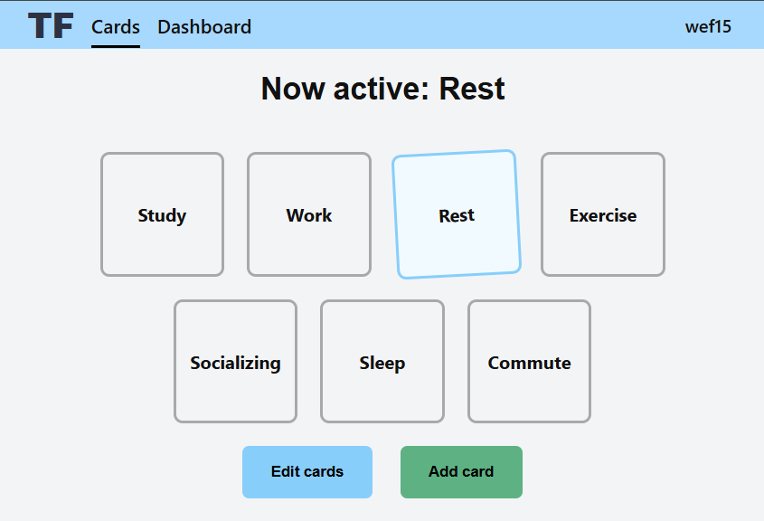
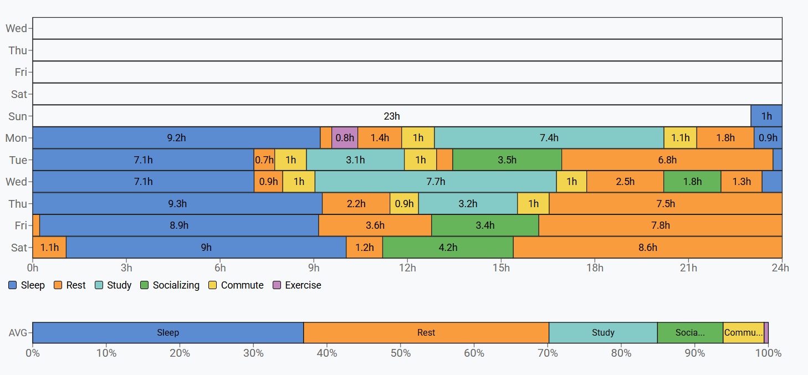

# TimeFlow
A website for tracking your time.
    
## Tech Stack

| Area        | Technologies                                |
|-------------|---------------------------------------------|
| Frontend    | Next.js 15, React 19                        |
| Backend     | FastAPI, SQLAlchemy + Alembic               |
| Database    | PostgreSQL 16 (prod), SQLite (dev)          |
| Infrastructure | Docker, Docker Compose, Nginx            |


## Screenshots




## Quick Start (Local)
### Backend
```bash
cd backend
pip install -r requirements.txt
uvicorn src.main:app 
```
### Frontend
```bash
cd frontend
npm install
npm run dev
```

## Production Deployment

### Deployment
```
1) create and edit .env.prod file
2) edit nginx/default.conf
3) edit frontend/src/config.js
4) docker compose build
5) docker compose up -d
6) get ssl certificate:
docker compose run --rm certbot certonly --webroot \
  --webroot-path=/var/www/certbot \
  --email <email> --agree-tos --no-eff-email \
  -d <domain> -d <...>
7) restart nginx container:
docker compose restart nginx
```

### Certificate auto renew
```bash
0 3 * * * docker compose run --rm certbot renew --webroot -w /var/www/certbot --quiet && docker kill -s HUP nginx_proxy
```

## License
This project is licensed under the [MIT License](LICENSE.md).